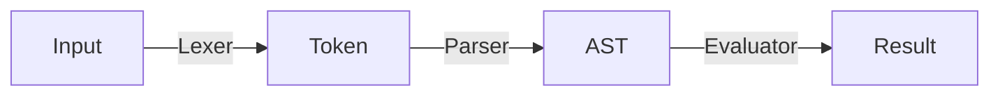

# Calculator based on AST

A simple AST-based calculator that can parse and evaluate arithmetic expressions.

> **Disclaimer**: This is a simple project to learn about the concept of lexing and parsing. It is not intended to be used in production.

How does it work? Here is the data flow of the calculator. You can see that the input is first tokenized, then parsed into an AST thought, and finally evaluated to produce the result.



## Run it in CLI

The CLI version can be run using cargo. After it is run, you can see `>>` prompt to enter the expression. You can enter the expression and press enter to see the result.

```shell
> cargo run
   Compiling ast-calculator v0.1.0 (/Users/situ/Codes/Playground/ast-calculator)
    Finished dev [unoptimized + debuginfo] target(s) in 0.81s
     Running `target/debug/ast-calculator`
Welcome to the AST calculator! Just type in an expression and press enter.
>> 123 + 321
444
>>
```

## Run it on Web

The calculator can also be run on the web because it can be compiled to WebAssembly.

To run it, you should compile it to WASM first and then start the web app in folder `app`. Make sure you have `wasm-pack` and `pnpm` installed.

```shell
wasm-pack build
cd app
pnpm
pnpm dev
```

## Credits

This project is based on the tutorial [How to Build a Calculator](https://fenga.medium.com/how-to-build-a-calculator-bf558e6bd8eb) and its [C# implementation](https://github.com/Cosinhs/Calculator) (This is a forked version of the original project since the original one is 404 Not Found).
